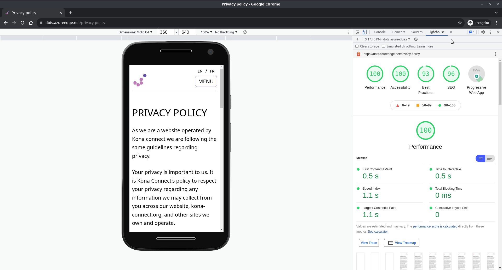

# Performance and Accessibility

We took performance and accessibility seriously and monitored it along the way. We used Lighthouse to check this information. Lighthouse is an open-source, automated tool for improving the quality of web pages. You can run it against any web page, public or requiring authentication. It has audits for performance, accessibility, progressive web apps, SEO and more. To find out more, go [here](https://developers.google.com/web/tools/lighthouse).

Here are the final analysis for:

### The homepage

### The quiz

### The organisation page

### The organisation list

### The quiz result page

### The privacy policy page

### The contact us page

As you can tell most of the website has a pretty good scoring, but there are some small adjustments which could helps improve the performance of some pages that we didn't have time to do. For example limiting the number of organisations displayed on the results page or using pagination for the organisations list page could help improve the performance of the website.

Another way we could have improved the performance of the website was by reducing the data transfert between the frontend and the backend.
